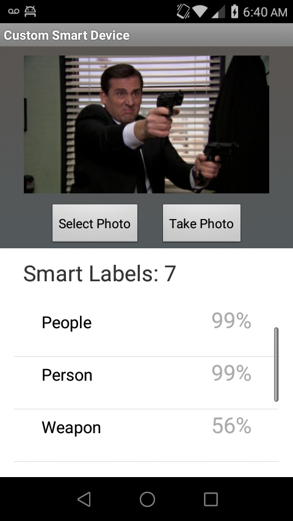

========================================
Smart Device Cloud 
========================================

This project lets you create your own personal smart device cloud with your (mobile) devices

Use with your current mobile device, as well as repurposing your older and or unused mobile devices and tablets as smart home devices. 

----------------------------
Project Status: Experimental
----------------------------

Currently supporting:

1. Mobile Client App
-Android (Java)

2. Device Cloud Backend
-AWS (Lambda Python3.6,DynamoDB,S3,API Gateway)

3. Cloud Entity Interface
-Alexa (Smart Home Camera Device Skill v3api)

----------------
Current Features
----------------

* Smart Image Labels Detection

-------------------
Current Screenshots
-------------------

.. image:: ./Examples/Images/android_smart_device_aws_rekognition_smart_labels_package.png
.. image:: ./Examples/Images/android_smart_device_aws_rekognition_smart_labels_cat.png

.. image:: ./Examples/Images/android_smart_device_aws_rekognition_smart_labels_person.png
.. image:: ./Examples/Images/android_smart_device_aws_rekognition_smart_labels_vader.png

-------------------------------------------------
Possible Upcoming Features and Example Scenarios:
-------------------------------------------------

1. Smart Image Text Detection/Translation
2. Ask Alexa to detect/translate objects/text seen from any of your mobile device cameras
3. Ask Alexa when it last detected an object from one of your mobile devices
4. Other types of mobile device input (Bluetooth,Wifi,Tempurature,Audio)

^^^^^^^^^^^
SCENARIO 1: 
^^^^^^^^^^^
Alexa answers package delivery info

1: Setup your android devices as smart home devices in Alexa
-Android device #1 camera points towards front porch/door
-Android device #2 camera points towards driveway/street

2: Ask Alexa: 
"Did I have packages delivered today?"

3: Alexa responds:
"Yes, I detected at [#1 camera] a [UPS truck] arrived at [12:30pm] and delivered [#X packages] first detected by [#2 camera(doorstep)] and [are still present] at [#2 camera(doorstep)]

^^^^^^^^^^^
SCENARIO 2: 
^^^^^^^^^^^
Alexa can tell you if and when your pets/children are detected in locations on your property

1: Setup your android devices as smart home devices in Alexa
-Android device #1 camera points towards backyard
-Android device #2 camera points towards inside garage
-Android device #3 camera points towards home shed/work area

2: Ask Alexa: 
"Are my kids in the backyard?"
"When did you last see my cat?"

3: Alexa responds:
I last detected [a child]from location [#1 camera(backyard)] at [3:30PM Today] (5 Minutes ago)
I last detected [a cat] from location [#1 camera(backyard)] at [3:30PM Today] (5 Minutes ago)

^^^^^^^^^^^
SCENARIO 3: 
^^^^^^^^^^^
Detect prohibited items such as weapons at your home/business

1: Setup your android devices as smart home devices in Alexa
-Android device #1 camera points towards business entrance/reception area

2: Ask Alexa: 
"Alexa flash alert"

3: Alexa responds:
WEAPONS ALERT: I last detected an [AR-15 assault rifle] at location [#1 camera(entrance/reception area)] at [3:30PM Today] (5 Minutes ago)

^^^^^^^^^^^
SCENARIO 4: 
^^^^^^^^^^^
At the grocery store, detect and convert oz/lbs on food/product labels to identify best product deal

1: Setup your android device as smart home devices in Alexa
-Android device #1 camera (users primary mobile phone) is at store pointed at product label

2: Ask Alexa: 
"Alexa inspect product labels"

3: Alexa responds (visual display):
Products detected: 
[Chocolate] [$2.00/lb] converted is [$1.60/oz]
[Chocolate from bulk] [$.10/oz] converted is [$1.60/lb]

^^^^^^^^^^^
SCENARIO 5: 
^^^^^^^^^^^
Detect English text in an image and convert to another language

1: Setup your android device as smart home devices in Alexa
-Android device #1 camera (users primary mobile phone) points towards an object such as a restaraunt menu

2: Ask Alexa: 
"Alexa translate what you see on my [primary phone]"

3: Alexa responds (visual display):
Original image overlayed with translation

-------------
Project Goals
-------------

Experiment with new tech in order to create a system that is:

-Useful
-Secure
-Private

-------
Contact
-------

David Zentner
dazcode@gmail.com

## License
